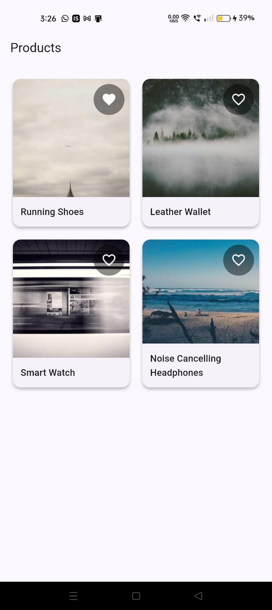
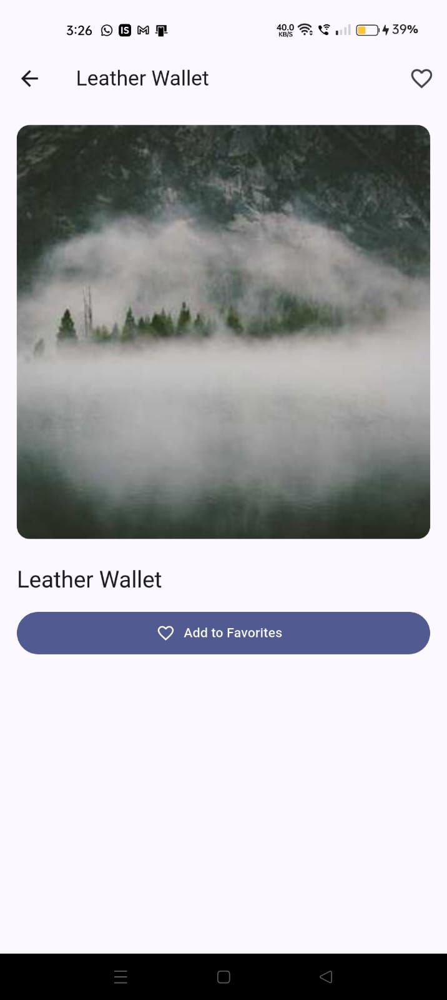
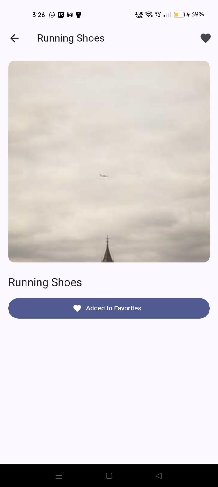
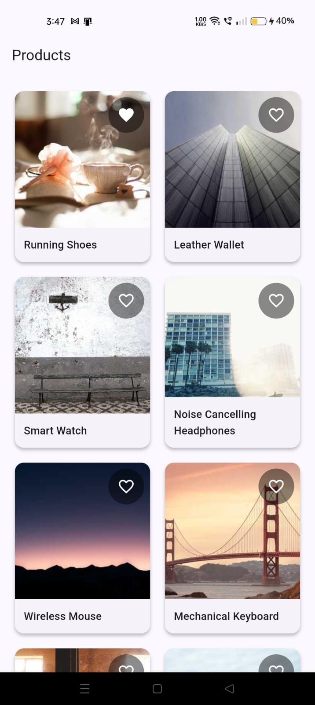

# Product Image Viewer

A Flutter app that displays products in a grid layout with favorites functionality.

## How to Run

1. **Install Flutter** (if not already installed)
   - Follow the [official Flutter installation guide](https://docs.flutter.dev/get-started/install)

2. **Get dependencies**
   ```bash
   flutter pub get
   ```

3. **Run the app**
   ```bash
   flutter run
   ```

The app fetches products from `https://fakestoreapi.com/products`. If the API is unavailable, it automatically falls back to a local JSON file (`assets/products_fallback.json`) which contains 16 sample products.

## Screenshots

<p align="center">
  
  
  
  
</p>

## Architecture

- **State Management**: Provider pattern for managing products and favorites
- **Data Layer**: Service class handles API calls with automatic fallback to local assets
- **Persistence**: SharedPreferences stores favorite product IDs locally
- **UI Structure**:
  - Grid screen displays products in a responsive card layout
  - Detail screen shows product image and title with favorite toggle
  - Hero animations for smooth image transitions

## Key Decisions

- **Provider over setState**: Better separation of concerns and easier state sharing
- **Automatic fallback**: Seamless experience even when API is down
- **Local persistence**: Favorites persist across app restarts
- **Responsive grid**: Adapts to different screen sizes automatically

## Assumptions & Limitations

- API returns products in the format: `[{id, title, imageUrl}]`
- Images are loaded from external URLs (picsum.photos in fallback)
- No authentication required
- Favorites are stored locally only (not synced across devices)
- Network errors are handled gracefully with fallback data
